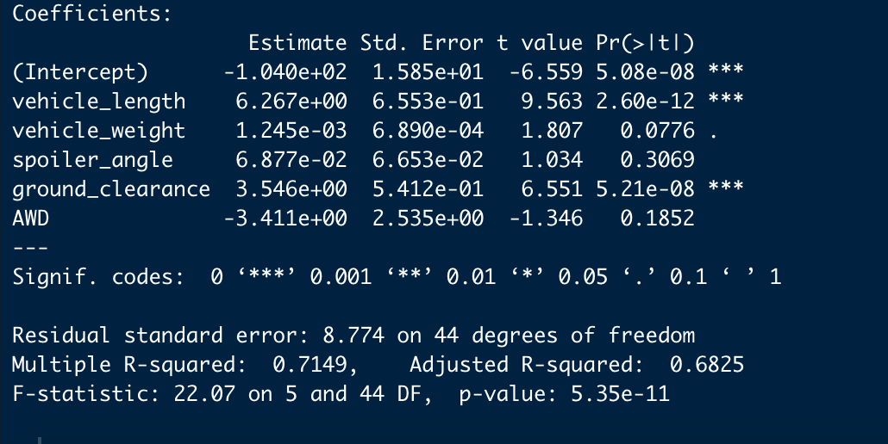
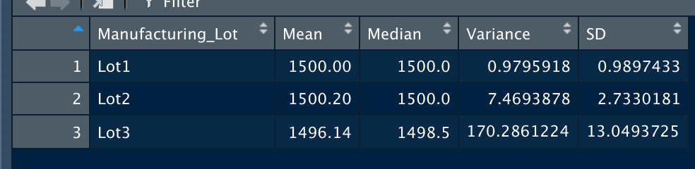
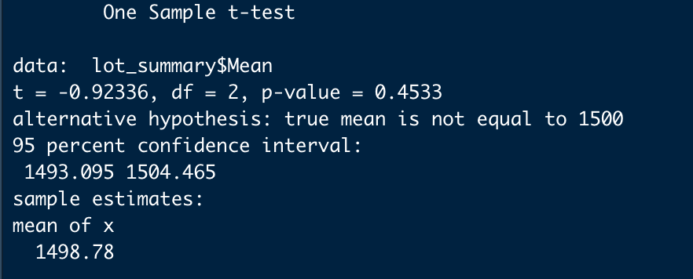
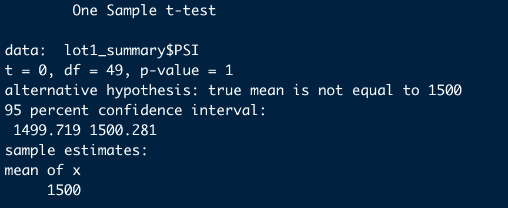
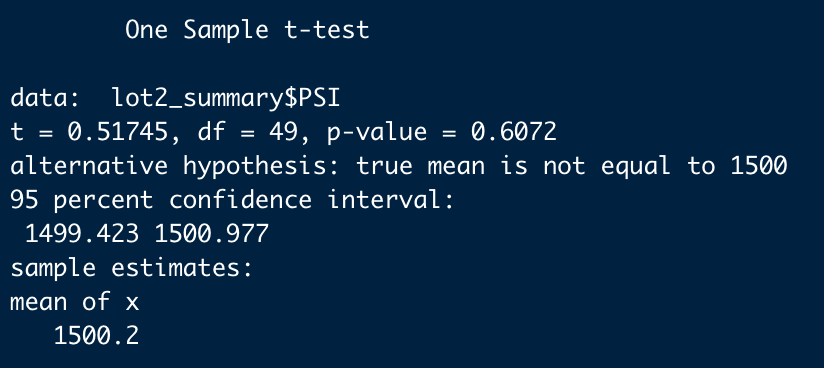
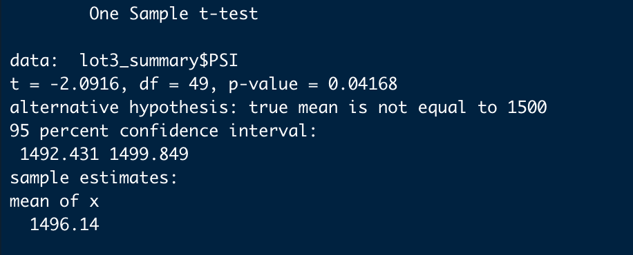
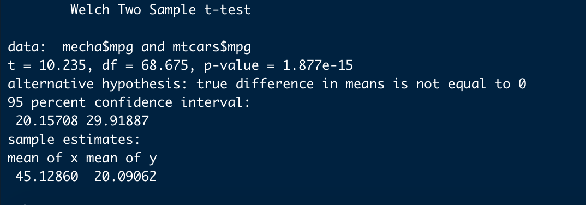

# MechaCar_Statistical_Analysis
## Linear Regression to Predict MPG

The regression line provides the following equation.
The linear regression vehicle length and ground clearance have a p-value less than 0.05, therefore, provided a non-random amount of variance to the mpg values. The vehicle weight spoiler angle and AWD has a p-value that is greater than 0.05, thus offered a random amount of variance to the mpg values. 
The linear model's slope is non-zero because the intercepts and the linear regression coefficients are non-zero. If the slope is zero, then the values of mpg remain constant. But from the above linear model, mpg values vary as the vehicle weights, vehicle length, spoiler angle ground clearance, and AWD vary. 
However, the linear model does not predict the mpg of MechaCar prototypes effectively. Because the R square value of 0.71 or 71% is not significant enough to provide the confidence in independent variables(Vehicle weight, vehicle length, spoiler angle, AWD, and ground clearance) explaining the variation in the dependent variable(mpg). 75% and above R square would be required to predict mpg effectively. Also, some of the independent variables(vehicle weight, spoiler angle, and AWD) 
contain some level multicollinearity that is affecting the effectiveness of the model. These variables could be eliminated.

## Summary Statistics on Suspension Coils

The MechaCar suspension coils' design specifications dictate that the variance of the suspension coils must not exceed 100 pounds per square inch. The current manufacturing data meet this design specification for all manufacturing lots in total as the variance is 62 pounds. However, the design specification for the MechaCar suspension meets Lot1 and Lot2 as their variance does not exceed 100 pounds per square. But the design specification for Lot3 exceed 100 pounds as it's variance is 170. 
## T-Tests on Suspension Coils

## Study Design: MechaCar vs Competition.
### Description
Hypotheses are utilized by the scientific method to help narrow the scope of research and testing and provide a clear outcome of our results. 
Choosing whether to perform a one-tailed or a two-tailed hypothesis testing is one of the basic concepts of inferential statistics, which is run to determine whether a claim is true or not, given a population parameter. When testing is programmed to show whether the mean of a sample is significantly greater than or significantly less than the mean of a population, that is referred to as a two-tailed test.
### Metrics
In this study, mpg mean of MechaCar is compared with Mtcars mpg to see if there is a significant difference in MechaCar miles per gallon and Mtcars miles per gallon.
### Hypothesis 
Null Hypothesis(H0): There is no significant difference between the mean of MechaCar mpg and Mtcars mpg
Alternative Hypothesis (Ha): There us a significant difference between the mean of MechaCar mpg and Mtcars mpg
### Statistical testing
A two-tailed test would be used for MechaCar production activities to determine if the production meets the industry standard.
A two-tailed test is designed to examine both sides of a specified data range as designated by the likelihood of a specified outcome known as a probability distribution. involved
### Data to be used 
MechaCar mpg data and Mtcars mpg data
### Results and analysis
The results show significant differences between the mean of MechaCar mpg and Mtcars mpg; therefore, the null hypothesis is rejected, and the alternative hypothesis is accepted.

The results show that, the mean of MechaCar mpg is 45 while Mtcars mpg is 20. This indicate that, the competitor products are more fuel efficient than MechaCar. MechaCar need to improve on this area in order to be competitive in the market.

